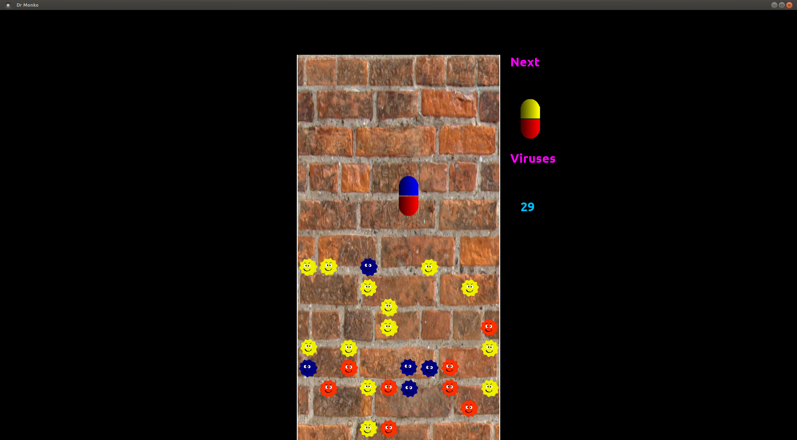

# drmonko

drmonko is a 2d puzzle game written in c++ with networking support. 

The rules are similar to Dr. Mario for nintendo but uses orignal art and graphics.

## Requirements:
````
libsdl-net   1.2
libsdl-ttf   2.0
libsdl       1.2
libsdl-mixer 1.2
libgl
g++
cmake
````

## Distrubution 
git://github.com/kpelton/drmonko.git

Drmonko is distributed as C++ source code as a cmake project. This code has been compiled on Linux 2.6(Ubuntu 11.04 and Debian squeeze). It is possible to compile it under Windows but you will have to figure it out on your own. 


## Compilation
To get the necessary dependencies under Ubuntu or Debian:
````
apt-get install cmake g++ libsdl-net1.2-dev libsdl-ttf2.0-dev libsdl1.2-dev libsdl-mixer1.2-dev git
````

````
git clone git://github.com/kpelton/drmonko.git

cd drmonko
cmake src
make
````
To run the game:
````./drmonko````


## Configuration
For now the game only runs in the source directory.

## Caveats
If you host a game under the 2 player network menu, the game will pause until someone connects to the server. I have not yet written a wait screen.

The networking code is a bit quirky but it seems to work most of the time.

There is no way to change the resoultion unless you edit src/sdlWindow.h and rebuild. I hope to add a resoultion menu in later versions.

## Copying
drmonko is open source software under a GPLv2 License
See the file COPYING for details

Game in action

